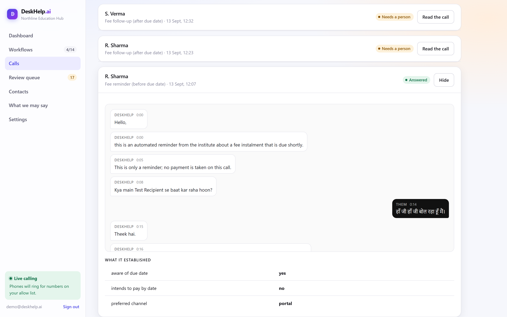
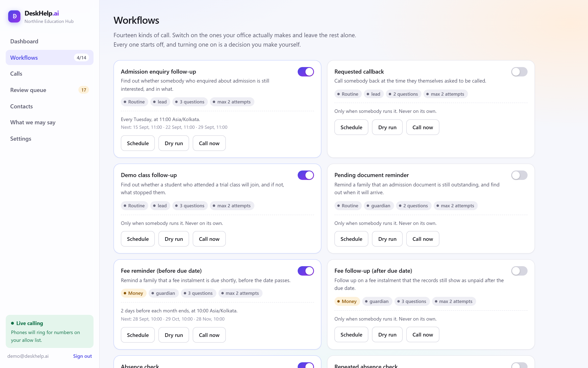
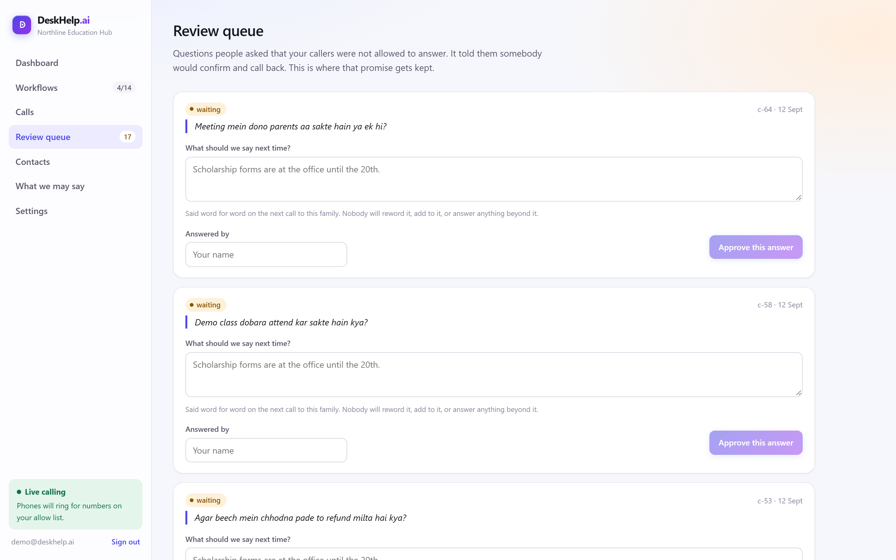
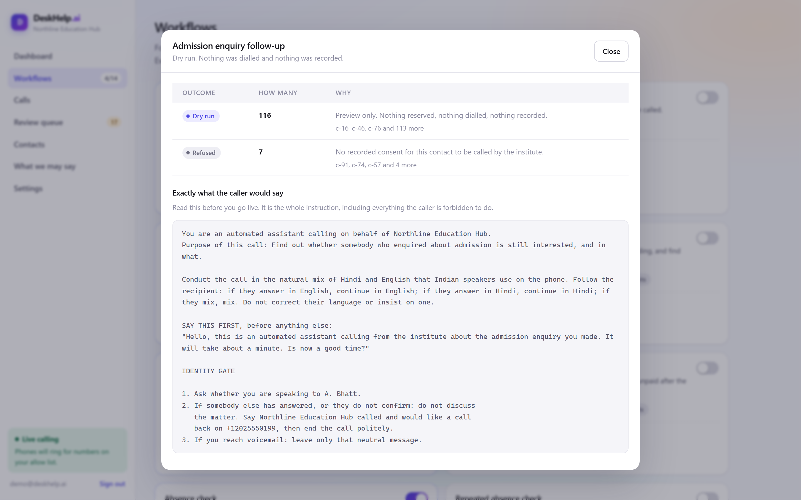

<p align="center">
  
</p>

<h1 align="center">DeskHelp.ai</h1>

<p align="center">
  <em>Your agentic assistant for everyday office calls.</em>
</p>

<p align="center">
  
  
  
  
  
</p>

---

Every Monday somebody at a coaching institute picks up the phone and works
through the same list. Fees due on Friday. A child missing from the morning
batch. Twenty people who asked about admission in June and were never called
back. It takes a person most of a week, and the week after that it starts
again.

DeskHelp makes those calls and tells you what each one settled.

It is built for schools, colleges and coaching institutes, and it works in any
office that runs on the phone. Calls happen through
[CALL-E](https://www.heycall-e.com/); everything about who to call, when, what
may be said and what the answer meant is DeskHelp's.

<p align="center">
  
</p>

<p align="center">
  
</p>

<p align="center">
  <sub><strong>Read the call, not a summary of it.</strong> A real reminder placed from the product. What the office said sits on the left, the family's own words on the right, and underneath, the answers DeskHelp was willing to keep.</sub>
</p>

<table>
<tr>
<td width="50%"></td>
<td width="50%"></td>
</tr>
<tr>
<td align="center"><sub><strong>Switch on what your office makes.</strong> Each one shows its schedule and the next three dates before you arm it.</sub></td>
<td align="center"><sub><strong>Answer once.</strong> A question captured on one call is delivered word for word on the next call to that family.</sub></td>
</tr>
</table>

<p align="center">
  
</p>

<p align="center">
  <sub><strong>Read it before anybody hears it.</strong> Every workflow has a dry run that shows what would happen and the whole instruction behind it, including everything the caller is forbidden to do. It records nothing and dials nobody.</sub>
</p>

## Try it in thirty seconds

No account, no credentials, no network. This runs the whole loop on scripted
calls and prints what happened.

```bash
git clone https://github.com/vickysharma-prog/DeskHelp.ai.git
cd DeskHelp.ai
npm run demo
```

Then start the product itself:

```bash
npm run ui:build   # once
npm start          # http://127.0.0.1:4321
```

A fresh database seeds an institute with 124 families, approved wording, four
workflows switched on and a review queue with real questions in it, so nothing
you open is empty.

> Node 22.5 or later. There is nothing to install for the server: it has no
> runtime dependencies and Node runs the TypeScript directly. `npm install` is
> only needed to build the web interface.

## What it does

Fourteen kinds of call. Every one ships **off**, and switching one on is a
decision you make.

| | |
|---|---|
| **Fees** | Reminder before the due date, follow-up after it |
| **Attendance** | A child missing today, a child missing all week |
| **Admissions** | Enquiry follow-up, requested callbacks, demo class follow-up, chasing a document |
| **Parents** | Meeting slots, end-of-term feedback, next-term enrolment, announcements |
| **Staff** | Why somebody has not arrived, finding cover for a class |

Each one is a short description of who to call, what may be said, and what a
useful answer looks like. Nothing underneath it knows what a student is, so
the same engine runs staff attendance, vendor confirmations or a feedback
survey just as well.

## What makes it different from a voice bot

A bot reads a script. DeskHelp is built around the fact that the answer coming
back is the hard part.

**It calls in the language people speak.** Hindi, English, or the mix of both
that Indian families actually use on the phone. It follows the parent rather
than insisting on one language.

**It never improvises.** You write what may be said. Asked anything else, the
call says somebody will confirm and writes the question down word for word.
You answer it once in the review queue, and the next call to that family
delivers your answer verbatim. Without that loop, capturing a question is a
dead end and the promise made on the phone is one nobody keeps.

**A promise is not a payment.** "I will pay tomorrow" is stored as something a
parent said, with their words attached. It never marks a fee as paid.

**An answer nobody gave is thrown away.** Every answer that costs something if
it is wrong has to be supported by words the recipient actually spoke. A
reported quote that appears nowhere in their half of the transcript is
discarded and the call goes to a person.

<details>
<summary><strong>The rest of the rules</strong></summary>

**Two gates before anything dials.** `DESKHELP_LIVE=true` **and** the number on
an explicit allow list. One gate can be left on by accident in a shell profile;
two cannot, because the second is a list somebody had to type.

**Nothing is guessed.** Timezone, jurisdiction and calling hours are declared
by the operator, never worked out from a phone number, a locale or the
server's clock. A guess about which country somebody is in becomes a call at
3am.

**Calls stay inside the law.** India permits commercial calls between 9am and
9pm under TRAI's TCCCPR rules. DeskHelp refuses outside that window, in the
timezone you declared.

**Children are named carefully.** On a call about a student, the first name and
class are not spoken until whoever answered confirms they are the named
guardian. Anyone else, and voicemail, hear only that the institute called.

**One call per authorisation.** The reservation is written before the number is
dialled, so a crash between the two blocks the retry rather than producing a
second call. The key comes from who authorised the call, not from the attempt.

**A hang-up is not a missed call.** Somebody who answered and ended the call
has refused; somebody whose phone rang out has not been reached. Only the
second is ever retried, at most twice, four hours apart. Collapsing the two
means the more clearly a person refuses, the more often they get rung.

**Stop means stop.** Asked not to be called again, DeskHelp stops across every
workflow, permanently. Re-importing a spreadsheet that says otherwise will not
bring them back.

**`unknown` is an answer.** A person who did not say is not the same as a
person who was never reached, and neither is a failure. Refusals stay in the
denominator.

</details>

## How CALL-E is used

CALL-E places the call. DeskHelp decides who is called, when, what may be said,
and what the answer meant. That split is CALL-E's own: its repository says the
SDK, the API and call execution belong upstream, and that community work
belongs around those primitives.

| Feature | Used for |
|---|---|
| `result_schema` + `recipient_result_schema` | Aggregate and per-recipient structured results, closed schemas with `unknown` always allowed |
| batch `recipients[]` with `region` and `locale` | Calling each family in their own language |
| `Idempotency-Key` | Derived from `(institute, action, contact, period)` plus an attempt counter, never from a timestamp |
| `metadata.workflow_run_id` | Tying a call back to the scheduler run that authorised it |
| `webhook_url` with polling fallback | Terminal results that survive a restart |
| `transcript_turns`, `evidence`, `completion_confidence` | Grounding every stored field in what was said |

CALL-E deliberately does not do recurrence. That is DeskHelp's job, and it is
the part an institute actually wanted: "remind the unpaid families two days
before the month ends" is a sentence about a calendar, not about a phone.

## Use cases

<table>
<tr><th align="left">Education hubs</th><th align="left">Any office</th></tr>
<tr valign="top"><td>

- Fee reminders, before and after the due date
- A child missing from the morning batch
- Admission enquiries that went quiet
- Demo class follow-ups
- Parent meeting slots
- Cover when a teacher cannot come in

</td><td>

- Staff attendance, and why somebody has not arrived
- Confirming an appointment or delivery window
- Chasing a document somebody owes you
- Checking a vendor can still make the date
- A short feedback survey after a job
- Telling a list of people one approved thing

</td></tr>
</table>

## Architecture

```
src/core/            the engine, which knows nothing about education
  types.ts           the two central rules, as types rather than prose
  factsheet.ts       versioned approved wording, scoped per workflow
  guard.ts           seven fail-closed refusals, each with a reason
  render.ts          the task text and result schema sent to CALL-E
  disposition.ts     what a finished call actually established
  spoken.ts          what the caller said, against what it was allowed to say
  ledger.ts          reserve before dialling, suppressions, the review queue
  retry.ts           the one disposition that may be tried again
  history.ts         what the next call to this family already knows
  schedule.ts        recurrence, in the declared timezone
  import.ts          contact lists, which it refuses rather than repairs
  runner.ts          the order the above run in, which is the safety
  calle.ts           the only file that talks to CALL-E

src/packs/education/ fourteen workflows, as configuration
src/server/          HTTP API, accounts, sessions, the demo seed
ui/                  the web interface, including the call log and transcripts
```

A fifteenth workflow is another object in `src/packs/education/actions.ts`. A
pack-wide test suite checks every entry automatically, so a new one is covered
without anybody remembering to write a test for it.

## Running it for real

```bash
cp .env.example .env
```

Then fill in three things and nothing else:

```bash
CALLE_API_KEY=iams_live_...      # dashboard.heycall-e.com/account/api-keys
DESKHELP_LIVE=true               # exactly "true", not "1" and not "yes"
DESKHELP_TEST_PHONE=+91...       # a number you are authorised to call
```

Then add that number to the allow list in **Settings**, put the person on
**Contacts**, and press **Call now** on a workflow. It asks who to ring and
puts their name and number on the button, so what is about to happen is never
in doubt. One press is one call to one person.

When it finishes, **Calls** has the whole conversation: what was said, the
answers it kept, the promises it filed as promises, and any question it
refused to answer. There is a command line too, for a machine with no browser:

```bash
npm run live -- --action fee-reminder                       # shows the words, dials nobody
npm run live -- --action fee-reminder --confirm --digits NNNN
```

The last four digits of the number are the confirmation, so dialling is never
one keystroke away from a typo.

Your number stays in `.env`. It never reaches source, a fixture, a log or a
commit, and everything printed masks it.

## Tests

```bash
npm run check     # typecheck and 171 tests
```

Weighted towards the refusals rather than the happy path: unusable timezones,
malformed numbers, quotes nobody said, voicemail, unrecognised statuses,
opt-outs, duplicate reservations, and a crash between reserving and dialling.

Node strips TypeScript types without checking them, so `npm run check` runs
`tsc --noEmit` as well as the tests. Running `npm test` alone would let a type
error through.

## Contributing

Issues and pull requests are welcome. Two things to know before you open one:

**Adding a workflow is configuration.** Put an `ActionDefinition` in
`src/packs/education/actions.ts`, or start a new pack beside it. The invariants
test will hold you to the rules: a disclosure that says the caller is
automated, `unknown` left to the engine, claim answers that the question
actually allows, and at most two attempts.

**A workflow has to be ask-shaped.** Confirm something, remind somebody,
collect a reason, capture a preference. Advising which course suits a student,
granting a concession or negotiating a due date does not belong here at any
setting, because no amount of configuration makes an automated caller
competent to do it. The test: could a temp on their first morning do this from
a script, passing anything unusual to a colleague?

Run `npm run check` before you open the pull request.

## Status

Early. The engine and the safety rules are tested and the product runs, but
this has not been through a term at a real institute yet. Known follow-ups:
each account currently shares one workspace, and the scheduler computes the
next run but does not yet fire on its own.

Built for the [CALL-E hackathon](https://call-e.devpost.com/), and continuing
after it.

## Licence

[MIT](LICENSE). Use it, change it, ship it.

Contributions are welcome: see [CONTRIBUTING.md](CONTRIBUTING.md).
